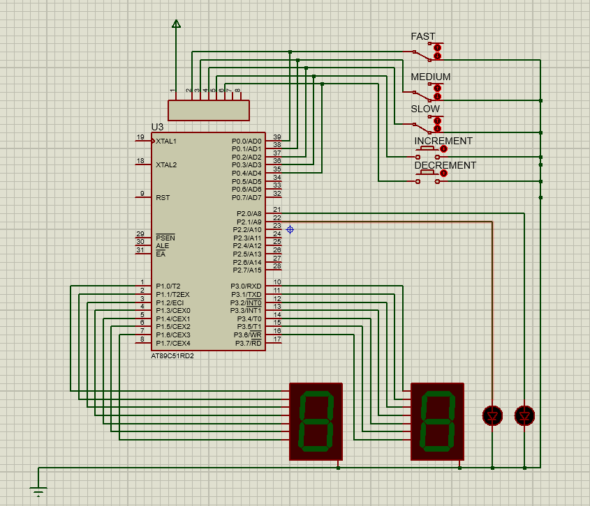

# Assignment1_Traffic-Light

## Table of Contents

- [Assignment1_Traffic-Light](#assignment1_traffic-light)
  - [Table of Contents](#table-of-contents)
  - [Objectives](#objectives)
  - [Toolbox](#toolbox)
  - [Steps Description](#steps-description)
  - [Created By](#created-by)
  - [About](#about)

## Objectives
- Warming up with OpenGL
- Modeling a 3D object
- Apply transformations to animate the model
- Interaction with the scene using keyboard

## Toolbox

- Silicon Labs C8051F020-DK Micro-Controller
- Proteus
    - 2 *   7-Segment (Common Cathode).
    - 3 *   Switches.
    - 2 * Push Buttons.
    - Red LED.
    - Green LED.

## Steps Description

- The purpose here was to simulate a traffic light concepts using **C8051F020-DK Micro-Controller**. 
- The Red & Green LED Were connected on Port 2  bins 0 \& 1.
- 3 Switches and 2 Push Buttons were connected on Port 0 to act as inputs.
	
- Each one of the three Switches control the Speed of the count down. It is done using 3 different delay labels each corresponding to a specific count down speed. 
- The 2 Push Buttons control the Max \& Min values which the count down starts from. It was done by Equating two variables with initial count down values, then with each push on the buttons it decrement or increment the initial value.
- the two seven segments are connected to Port 1 \& Port 3. To show a specific number in each of the two 7-Segments a \textbf{Look Up Table} was used. the first 7-Segment Initially start from 3 and the other one from 9 and then loop to zero which cause the other 7-Segment to be decremented.
-  - when both 7-Segments reach Zero the Counter will reset to the default value to count down or to an new value based on the actions done using the input switches and buttons in the previous cycle.
- At the same time of reset the Two LEDS Toggle (If red was on, then it is off and Green is on and Vise Versa).    

## Created By 

-   Ramadan Ibrahim Mohey Eldin  [ramadan.ibrahem98@eng-st.cu.edu.eg](mailto:ramadan.ibrahem98@eng-st.cu.edu.eg)
 -   Mohamed Abdelkareem Seyam [mohamed.seyam99@eng-st.cu.edu.eg](mailto:mohamed.seyam99@eng-st.cu.edu.eg)
-   Mohamed Ahmed Abdelaziz [mohamed.ahmed997@eng-st.cu.edu.eg](mailto:mohamed.ahmed997@eng-st.cu.edu.eg)
-   Haithem Emad Ali [haitham.abdelmageed99@eng-st.cu.edu.eg](mailto:haitham.abdelmageed99@eng-st.cu.edu.eg)
 -   Saieed Khaled [saeedx.saeed99@eng-st.cu.edu.eg](mailto:saeedx.saeed99@eng-st.cu.edu.eg)
-   Mahmoud Mahamed Ibrahim [Mahmoud.behidy@gmail.com](mailto:Mahmoud.behidy@gmail.com)

## About

This project is a part of the Bio-Electronics curriculum  in the [Systems and Biomedical Engineering Department - Cairo University](http://bmes.cufe.edu.eg/)
- Dr. Ahmed Ehab
- TA. Mohamed Mostafa 

